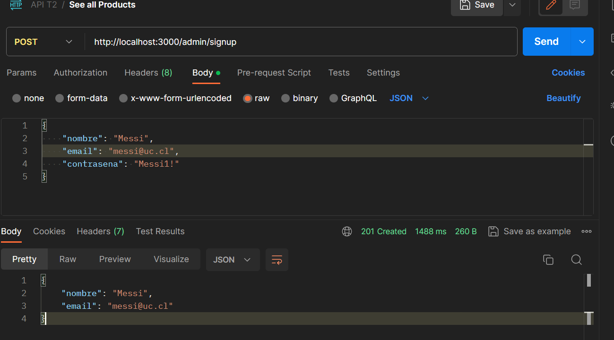

# grupo_Messi_backend

## Documentación API 
[GetPostMan 🔗](https://documenter.getpostman.com/view/26618082/2s9YXpUdse)


## Instalación JWT

En primer lugar, se debe agregar en `.env ` el siguiente parametro para el funcionamiento del Jason Web Token

```
JWT_SECRET = secreto_jwt
```

Posteriormente se ejecutan las siguientes lineas para añadir el paquete `koa-jwt` y `jsonwebtoken` para el manejo de hashing.

```
yarn add jsonwebtoken
yarn add koa-jwt
```

## Implementación: JWT (Autenticaciones)

Para crear un entorno protegido y confiable se crean los siguientes archivos:

1. `authenticationChoferes.js`, `authenticationClientes.js`, `authenticationAdmin.js:` Archivos con protocolo para implementar rutas de acceso seguro para el registro *signup* y el inicio de sesión *login* de cada **chofer**, **cliente** y **admin**.
2. `routes.js:`  Para las rutas de servicios, clientes, choferes y administradores se implementa un middleware de Koa que utiliza *koa-jwt* para proteger estas rutas.
3. `scope.js:` Define un conjunto de rutas protegidas que requieren un alcance específico para acceder. Estas rutas utilizan funciones de utilidad de autenticación `authUtils` para verificar si el usuario que realiza la solicitud tiene el alcance adecuado, según el tipo de usuario (cliente, chofer, admin) identificado en el token JWT.
4. `jwt.js:` Proporciona funciones de utilidad para verificar el alcance scope de un token JWT y funciones de middleware para garantizar que el usuario que realiza una solicitud tenga el alcance adecuado.

## Implementación: Admin

Como se visualiza en la imagen, la creación del administrador se realiza a través de Postman, para crear el usuario con la contraseña hasheada.




## Intalación API

Para construir una API, se revisó la documentación presente en la Ayudantía 4. El framework que se utilizó para crear aplicaciones web corresponde a KOA y se implementó de la siguiente manera.

Iniciarmos un nuevo proyecto

```
yarn init
```

Agregamos KOA al proyecto

```
yarn add koa
```

Sin usar vite, se crea el proyecto "Node", de modo que se configura package.json.

Luego se usa el Middleware que actúa como intermediario entre los diferentes componentes de la aplicación para procesar, transformar o gestionar datos.

***Koa-logger*** se utiliza para registrar información relacionada con las solicitudes HTTP entrantes y respuestas. Para agregar Koa-logger se hace de la siguiente manera:

```
yarn add koa-logger
```

luego se integra en el `index.js`, mediante `import KoaLogger from 'koa-logger';`.

***koa-boddy*** se utiliza para que los datos del cuerpo de la solicitud se pueden procesar y utilizar de manera conveniente en el contexto de la aplicación Koa (*parsear*). Se integra de la siguiente manera:

```
yarn add koa-body
```

luego se integra en el `index.js`, mediante `import { koaBody } from 'koa-body';`

***koa-router*** se utiliza para facilitar la gestión de las rutas y las acciones asociadas en la app. Permite definir metodos HTTP como GET, POST, DELETE, PUT, etc.

```
yarn add koa-router
```

## Intalación y levantamiento Base de Datos

#### PostgrSQL

A partir de las cápsulas, para comenzar con el levantamiento de la base de datos se corre el siguiente comando que instalará PostgreSQL en el sistema y también instalará algunos paquetes adicionales y extensiones que serán útiles posteriormente:

```
sudo apt install postgresql postgresql-contrib
```

Luego, se crea el usuario y la base de datos que se utilizará de forma local con los siguientes comandos:

```
sudo -u postgres createuser --superuser "nombredeusuario"
```

```
sudo -u postgres createdb "basededatos_development"
```

Posteriormente se le asigna un nombre y contraseña de acceso al usuario con:

```
ALTER USER "nombredeusuario" WITH PASSWORD 'constrasena';
```

Paralelamente se asigna la base de datos con que el usuario:

```
psql -U "nombredeusuario" -d "basededatos_development" -h 127.0.0.1
```

#### Sequelize

Sequelize es un ORM (Object-Relational Mapping) de Node.js que facilita la interacción con bases de datos relacionales al proporcionar una abstracción sobre la base de datos. Para su correcta instalación se realiza lo siguiente en la terminal:

```
yarn add sequelize
```

Para ejecutar comandos relacionados con Sequelize directamente desde la línea de comandos:

```
yarn add sequelize-cli
```

Para generar `config.json` se tiene el siguiente comando:

```
yarn sequelize init
```

Luego se instala un parametro en package.json:

```
yarn add pg
```

Posteriormente,

```
yarn add dotenv
```

lo cual permitirá la creación del archivo `.env` donde se guardan las credenciales para acceder a la base de datos:

```
DB_USERNAME = nombredeusuario
DB_PASSWORD = contrasena
DB_NAME = basededatos
DB_HOST = 'localhost'
```

#### Integrar modelo E/R

Para llevar el modelo al backend, es necesario realizar las migraciones con el siguiente comando:

```
yarn sequelize-cli db:migrate
```

Una vez hecho esto, es posible crear las tablas para la base de datos con el siguiente comando.

```
yarn sequelize-cli seed:generate --name seed-users
```

Sin embargo, para esta entrega solo es necesario crearlas una sola vez, de modo que para correr que funcione la base de datos correctamente no es necesario correr este último comando.

Una vez hecho todo lo anterior, se corre `yarn dev` para que `localhost:3000` reciba y responda las consultas.
